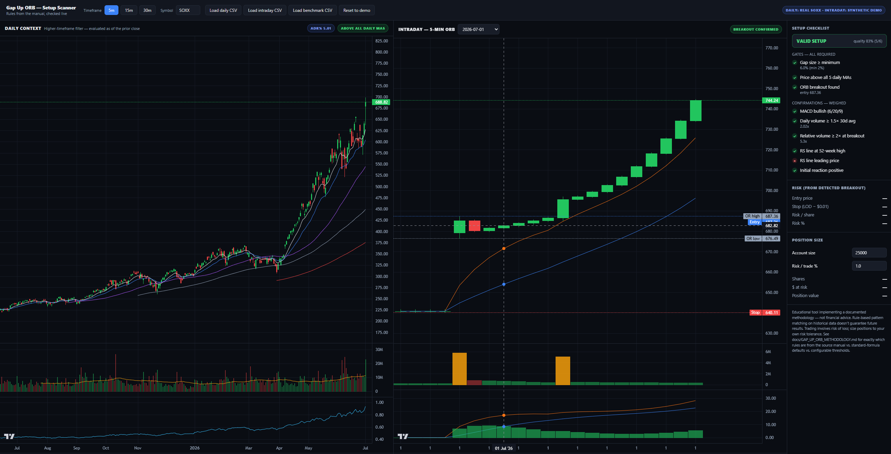

# Gap Up ORB — Setup Scanner

A single-file, browser-based **educational charting tool** that implements a documented **Gap Up Opening Range Breakout (ORB)** methodology. It scans daily + intraday bars, evaluates every rule in the manual, and shows a live setup checklist with risk/position sizing.

> ⚠️ **Not financial advice.** This is an educational implementation of a rule-based methodology. Pattern matching on historical data does not guarantee future results. See the disclaimer in the app.


---

## What it does

The scanner answers one question: **"Does this ticker, on this session, satisfy every gate of the Gap Up ORB setup — and if so, how clean is the signal?"**

It computes:

- **Daily context** — 10/21 EMA, 50/100/200 SMA stack, ADR%, volume vs. 30-day average, and a relative-strength line vs. a benchmark (default QQQ).
- **Intraday setup** — opening range (first bar of the regular session), breakout detection (close above OR high *and* above both intraday EMAs), initial reaction quality, relative volume at breakout, and MACD 6/20/9 state at entry.
- **Risk block** — entry price, stop (LOD − $0.01), risk per share, risk %.
- **Position sizing** — shares, dollar risk, and position value from account size and risk-per-trade %.
- **Setup checklist** — three hard **gates** (all required) plus six weighed **confirmations**, with an overall VALID / NOT MET badge and a quality score.

Everything renders into two linked Lightweight Charts panels (daily + intraday) and a sidebar checklist.

---

## Gates vs. confirmations

**Gates — all required:**

| Gate | Rule |
|---|---|
| Gap size | Today's open gaps ≥ `minGapPct` (default 2.0%) above prior close |
| MA stack | Prior close is above **all five** daily MAs (10/21 EMA, 50/100/200 SMA) |
| Breakout | Price closes above the opening range high **and** above both intraday EMAs after the OR |

**Confirmations — weighed (quality score):**

- MACD 6/20/9 bullish at breakout
- Daily volume ≥ 1.5× 30-day average
- Relative volume ≥ 2× at breakout
- RS line at a 52-week high
- RS line leading price
- Initial reaction positive (first bar closes green in upper half of its range)

---

## Data sources

| Panel | Default source |
|---|---|
| Daily | **Real SOXX vs. QQQ** history embedded in the file |
| Intraday | **Synthetic demo session** — clearly flagged in the UI |

The demo anchors at the most recent real date where SOXX genuinely closed above all five daily MAs, then invents one gap day from that price level. This avoids fabricating the precondition or silently showing a demo that fails its own gate.

You can load your own CSVs for daily, intraday, and benchmark via the header buttons. Column aliases match the Python scanner (`time/date/datetime`, `open/o`, `high/h`, `low/l`, `close/c/adj close`, `volume/vol/v`), so files work interchangeably.

---

## Architecture

```
index.html
├── Lightweight Charts v5.2.1 (inlined)
├── chart_engine.js      — indicator math, exposed as window.__chartEngineIndicators
├── orb_engine.js        — Gap Up ORB rules, exposed as window.GapUpORB
└── app-logic.js         — charts, UI, CSV loading, orchestration
```

**Key design choice:** `orb_engine.js` does **not** re-derive indicators. It imports `sma`, `ema`, and `macd` from `chart_engine.js`'s additive export, so the daily MA stack and MACD lines drawn on the chart are pixel-identical to what the scanner evaluates.

`orb_engine.js` also runs headlessly under Node (`module.exports`), so the rule engine can be unit tested without a browser.

---

## Spec provenance

Every constant in `PARAMS` (inside `orb_engine.js`) mirrors `spec/gap_up_orb_spec.json` field-for-field. That spec tags each value with its provenance:

- **manual** — taken directly from the source methodology
- **standard** — conventional indicator default (e.g. MACD 6/20/9)
- **configurable** — tunable threshold (e.g. `minGapPct`, `largeRatio`)
- **addition** — added for scanning convenience, **not** from the manual

Two fields are explicitly tagged `addition` and should not be treated as documented rules:

- `minGapPct` (2.0%) — a scanning convenience so a batch scan doesn't flag every 0.1% gap
- `rsLeadingPrice` — extends the manual's 52-week RS-high rule one step further (RS makes a new high while price has not)

The Python mirror of `PARAMS` lives in `scanner/gap_up_orb/spec.py`. There is **no automated JS↔Python sync check** — `scanner/tests/test_spec_sync.py` only validates the JSON spec against the Python `PARAMS`. If you change a value in `orb_engine.js`, update both `spec/gap_up_orb_spec.json` and `spec.py` by hand.

---

## Usage

1. Open `index.html` in a browser (works from `file://` — no build step, no server).
2. The demo loads automatically with real SOXX daily data + a synthetic intraday session.
3. Switch timeframes (5m / 15m / 30m) — 15m and 30m are aggregated from the 5m feed via `aggregateMinuteBars()`.
4. Pick a session from the dropdown to inspect a specific day.
5. Load your own CSVs to scan real sessions.
6. Adjust **Account size** and **Risk / trade %** to recompute position sizing live.

---

## Headless use (Node)

```js
const ORB = require("./orb_engine.js");

const records = ORB.evaluateSessions({
  dailyBars,          // required — chronological daily OHLCV
  intradayBars,       // required — intraday OHLCV of ONE timeframe
  benchDailyBars,     // optional — benchmark daily OHLCV, date-aligned
  timeframeLabel: "5min",
  earningsDates: [],  // optional — 'YYYY-MM-DD' strings for gap-cause tagging
});

// records is an array of flat, ML-friendly feature rows:
// {
//   ticker_date, timeframe,
//   gap: { pct, cause },
//   daily_context: { prior_close, ma_values, price_above_all_mas, adr_pct_20d, ... },
//   intraday_setup: { session_open_idx, opening_range, breakout, macd_at_breakout, ... },
//   risk: { entryPrice, stopPrice, riskDollar, riskPct },
//   gates: { ... }, gates_all_passed,
//   confirmations: { ... }, confirmation_count, confirmation_total,
//   is_valid_setup, setup_quality_score
// }
```

Every field is a named, typed leaf (bool / number / string) — flat enough to push straight into a dataframe row.

---

## Session & timezone handling

Session detection uses a real IANA timezone (`America/New_York` by default) via `Intl.DateTimeFormat`, so DST is handled correctly rather than with a fixed UTC offset. Bar timestamps are accepted as either Unix seconds or parseable date strings.

`detectSessions()` returns one record per calendar day, with:
- `dayStartIdx` / `dayEndIdx` — every bar for that date (including pre/post-market if present)
- `sessionOpenIdx` — first bar at/after the regular session open (09:30 ET)

The opening range is the first `openingRange.bars` bars from `sessionOpenIdx`.

---

## Risk management rules

| Field | Rule |
|---|---|
| Entry | Opening range high |
| Stop | Low of day (from session start to breakout bar) − $0.01 |
| Risk / share | Entry − Stop |
| Risk % | (Entry − Stop) / Entry × 100 |
| Shares | floor(Account × Risk% ÷ Risk-per-share) |

Position sizing defaults: `accountSize = $25,000`, `riskPerTradePct = 1.0%`.

---

## What's NOT in this tool

- **No brokerage or trading services.** This is a charting/scanning tool only.
- **No live data feed.** You load CSVs or use the embedded real daily history.
- **No backtesting engine.** It evaluates setups session-by-session; it does not simulate P&L, slippage, or fills.
- **No execution.** Entries, stops, and sizes are informational.

---

## Disclaimer

Educational tool implementing a documented methodology — **not financial advice**. Rule-based pattern matching on historical data doesn't guarantee future results. Trading involves risk of loss; size positions to your own risk tolerance. See `docs/GAP_UP_ORB_METHODOLOGY.md` for exactly which rules come from the source manual vs. standard-formula defaults vs. configurable thresholds vs. additions.
